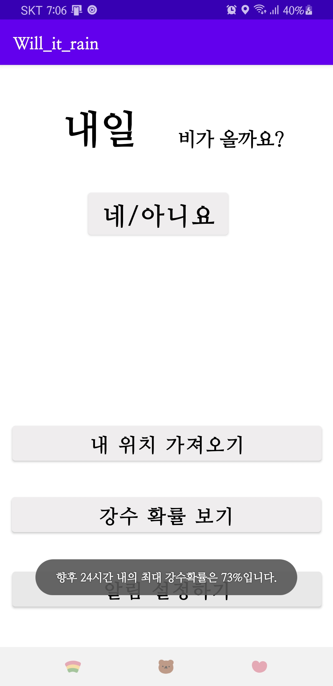
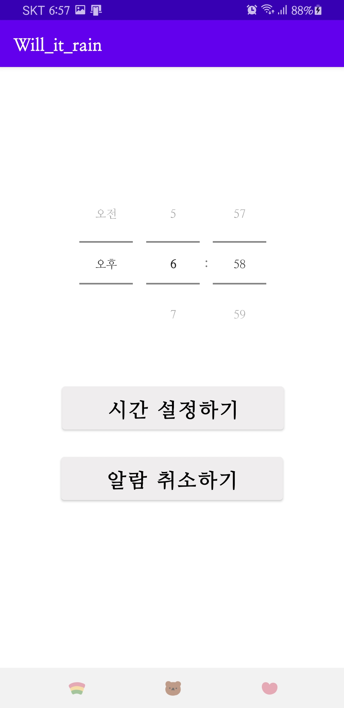
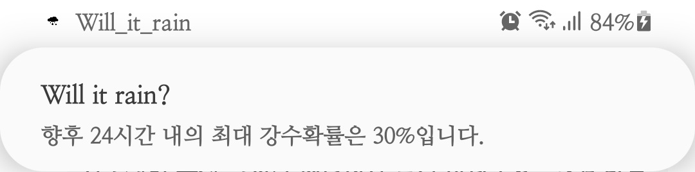
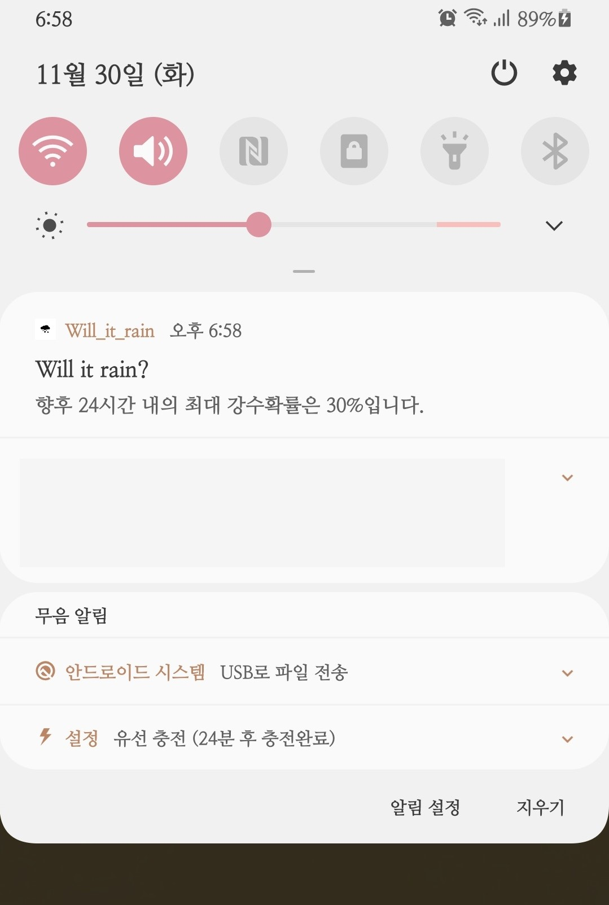

# Will-it-rain
창의공학기초설계 서울시립대 2021-Fall (박재선, 강다현, 강형원, 유영호)

 

  

## 주제 요약

* 과제 개요: 바쁜 아침에 오늘 비가 오는지 알려준다. 날씨 앱들은 많이 있지만 아침에 들어가서 보려면 로딩시간이 꽤 오래 걸려 답답하고, 까먹기도 한다. 날씨가 맑은지, 흐린지보다는 비가 오는 사실만 궁금하다. 기상 알람에 알려준다

- 수행 방법: 안드로이드 앱개발. 지정한 위치의 날씨 정보 가져와서 24시간 이내에 비가 올 확률이 있으면 알람이 울린다.
- 수행 효과: 깜박하고 우산을 안 가져가서 퇴근 시간에 비를 맞는 불상사를 예방할 수 있다.

# 참여 인원

* 박재선 [@moran991231](https://github.com/moran991231) : 팀장, 환경구축
* 강다현 [@ddhyeon](https://github.com/ddhyeon) : git 관리
* 강형원 [@HyungWonKang](https://github.com/HyungWonKang) : ptt, YouTube 제작
* 유영호 [@younghoyk](https://github.com/younghoyk) : 보고서 작성 관리

# 보고서 공유용 쉐어포인트 (미정)

[링크](https://o365uos.sharepoint.com/sites/changui0)

